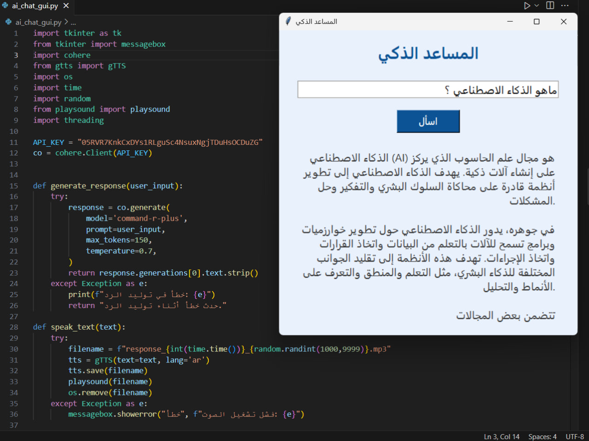

# AI-Assistant-Ar
##🧠 Smart Assistant – Arabic AI Voice Assistant



##📌 Overview

Smart Assistant is an interactive Arabic voice assistant that allows users to ask questions and receive intelligent responses — both in text and speech.  
Built using Cohere's command-r-plus model for natural language generation and gTTS for voice output, the assistant provides a smooth and user-friendly interface built with Tkinter.

This project was created as part of the Summer Training – AI Track in the Full Stack Robotics Engineer program.

---

## ⚙️ Features

- 💬 Ask any question in Arabic.
- 🧠 AI-generated answers using Cohere API.
- 🔊 Voice replies using Google Text-to-Speech (gTTS).
- 🎨 Simple and clean Tkinter GUI.
- ❌ Built-in error handling for smooth experience.

---

## 🖼 User Interface

| Component     | Description                            |
|---------------|----------------------------------------|
| Entry Field   | Type your question in Arabic.          |
| Ask Button    | Sends the question to the AI.          |
| Response Text | Displays the answer below.             |
| Voice Output  | Reads the answer aloud in Arabic.      |

---

## 📁 File Structure

| Filename                  | Description                                 |
|---------------------------|---------------------------------------------|
| ai_chat_gui.py          | Main GUI and voice assistant logic          |
| record.py               | Record audio and convert to text             |
| cohere_responses.py     | Generate AI text responses using Cohere      |
| cohere_text_to_speech.py| Convert text responses to Arabic speech      |
| ai_assistant.png        | Screenshot showing the result                |
| README.md               | Project documentation                        |

> Note: Temporary audio files (*.mp3) and output text files (output.txt, cohere_responses.txt) are generated during runtime and not included in this repository.

## 📦 Required Libraries

| Library    | Purpose                                          |
|------------|--------------------------------------------------|
| cohere   | Communicate with Cohere API for AI text generation |
| gTTS     | Convert text to speech using Google Text-to-Speech  |
| playsound| Play audio files in MP3 format                      |
| tkinter  | Create graphical user interface (built-in with Python) |
## 💻 How to Run

1. Download the project folder locally  
   Save it anywhere on your device, e.g. Desktop/ai-voice-assistant

2. Install the required libraries  
   Open your terminal or Anaconda Prompt and run:

   ```bash
   pip install cohere gTTS playsound

3. Add your Cohere API Key
Open ai_chat_gui.py and replace this line:

API_KEY = 05RVR7KnkCxDYs1RLguSc4NsuxNgjTDuHsOCDuZG

 4. Run the app
In the terminal, navigate to the project folder and run:

python ai_chat_gui.py
Or open it in VS Code and press Run ▶️.


## 🛠 Built With
 • Python
 • Cohere API 
 • gTTS 
 • Tkinter GUI 
 • playsound 

❓ FAQ

Q: Why is the voice delayed sometimes?
A: For longer answers, the voice may take an extra second to be generated and played. This is normal due to TTS processing.

Q: Can I change the language?
A: The assistant is currently optimized for Arabic input/output only.
